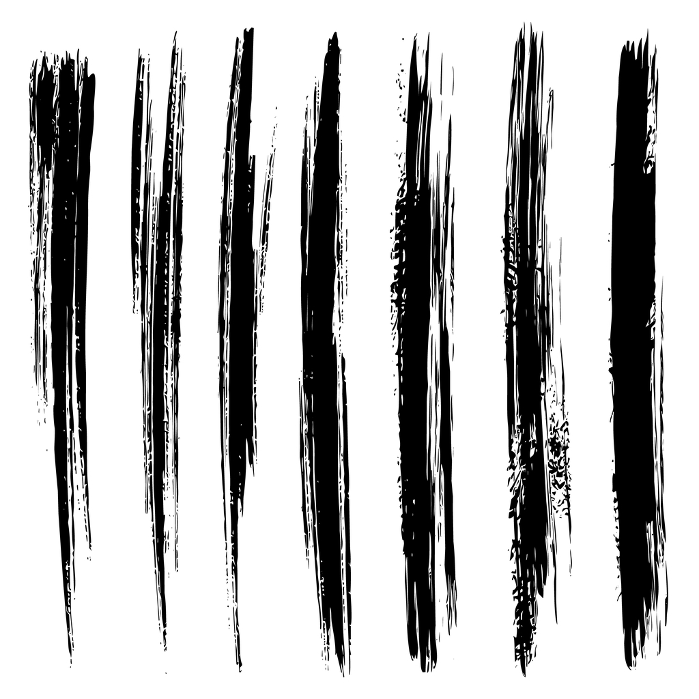

<p align="center">
  
</p>

<h1 align="center">StreakSync</h1>

<p align="center">
  <strong>Track your daily puzzle game streaks, compete with friends, and never lose a streak again.</strong>
</p>

<p align="center">
  
  
  
  
  
</p>

---

StreakSync is a native iOS app for tracking daily puzzle game streaks across 17+ games including Wordle, Connections, Strands, LinkedIn Queens, and more. Share your game results using the iOS Share Extension, and StreakSync automatically parses scores, tracks streaks, unlocks achievements, and lets you compete with friends on real-time leaderboards.

<!-- 
## Screenshots

| Dashboard | Friends Leaderboard | Achievements | Analytics |
|:---------:|:-------------------:|:------------:|:---------:|
|  |  |  |  |
-->

## Features

**Streak Tracking** — Automatic streak detection and maintenance for every supported game. Smart streak logic handles safe skip days, missed days, and edge cases across time zones.

**Share Extension** — Share your game results from any app. StreakSync parses the shared text, detects the game, extracts your score, and updates your streaks — all without leaving the source app.

**Friends & Leaderboards** — Add friends via 6-character friend codes. Real-time leaderboards powered by Firestore snapshot listeners show daily scores across all games, with streak badges and "hasn't played yet" sections.

**Tiered Achievements** — Bronze → Silver → Gold → Diamond progression across 10 achievement categories (Streak Master, Game Collector, Daily Devotee, Variety Player, and more). Unlock celebrations with particle effects and confetti.

**Analytics Dashboard** — Completion rates, streak trends, personal bests, weekly summaries, and deep-dive stats for specific games (guess distributions, time breakdowns). Interactive charts with export to CSV.

**Smart Reminders** — Analyzes your play history to suggest the optimal reminder time. Learns when you typically play and nudges you 30 minutes before your usual window.

**Guest Mode** — Let a friend try the app on your device without affecting your data. Snapshots and restores your state seamlessly.

## Supported Games

| NYT Games | LinkedIn Games | Other |
|-----------|---------------|-------|
| Wordle | Queens | Quordle |
| Connections | Tango | Octordle |
| Spelling Bee | Crossclimb | Nerdle |
| Mini Crossword | Pinpoint | Pips |
| Strands | Zip | |
| | Mini Sudoku | |

Each game has a dedicated parser that extracts scores, attempts, completion time, or hints from the shared result text. Custom games can also be added manually.

## Architecture

```
StreakSyncApp (@main)
 └─ AppContainer (DI container)
      ├─ AppState (@Observable) ─── Core data store + 7 focused extensions
      ├─ NavigationCoordinator ──── Tab-based navigation with per-tab stacks
      ├─ FirebaseSocialService ──── Friends, leaderboards, real-time listeners
      ├─ FirebaseAuthStateManager ─ Apple Sign-In + anonymous auth linking
      ├─ AnalyticsService ───────── Computed stats with fingerprint cache
      ├─ NotificationCoordinator ── Share extension + deep link handling
      ├─ GameCatalog (@Observable)─ Game registry + favorites
      └─ ... (haptics, sound, persistence, sync)
```

**Key patterns:**

- **MVVM** with a centralized `AppContainer` for dependency injection
- **Protocol-oriented services** — `SocialService` protocol backed by `FirebaseSocialService` (production) and `MockSocialService` (testing)
- **Swift Concurrency** — `async/await` throughout, `GameResultIngestionActor` for thread-safe share extension processing, structured concurrency with `async let` in analytics
- **@Observable** (Swift 5.9 Observation) for `AppState` and `GameCatalog`, `ObservableObject` where `@EnvironmentObject` is needed
- **Extension-based decomposition** — `AppState` split into 7 focused files (GameLogic, Persistence, Achievements, Reminders, etc.)
- **Pure computation extraction** — `AnalyticsComputer` and `TieredAchievementChecker` are testable structs with zero UI dependencies

## Project Structure

```
StreakSync/
├── App/                          # Entry point, DI container, app delegate
├── Core/
│   ├── State/                    # AppState + 7 extensions
│   ├── Models/                   # Game, GameResult, Streak, Achievement, Social models
│   ├── Services/                 # Firebase, notifications, analytics, persistence, sync
│   ├── Errors/                   # Typed error system (AppError)
│   └── Utilities/
├── Design System/                # Colors, haptics, animations, sound
├── Features/
│   ├── Dashboard/                # Home tab — streak overview, search, filters
│   ├── Friends/                  # Leaderboards, friend management
│   ├── Achievement/              # Tiered achievements grid, celebrations
│   ├── Analytics/                # Charts, trends, deep dives, CSV export
│   ├── Games/                    # Game detail, result history, management
│   ├── Settings/                 # Account, notifications, appearance
│   ├── Streaks/                  # All streaks view, streak history
│   └── Shared/                   # Reusable components (GradientAvatar, GameIconCarousel)
├── StreakSyncShareExtension/     # iOS Share Extension for result import
└── StreakSyncTests/              # 133 tests across 13 files
```

## Tech Stack

| Layer | Technology |
|-------|-----------|
| UI | SwiftUI (iOS 26, Liquid Glass) |
| Architecture | MVVM + DI Container |
| State | Swift Observation (`@Observable`) |
| Concurrency | Swift Concurrency (async/await, actors) |
| Backend | Firebase (Firestore, Auth) |
| Auth | Sign in with Apple + anonymous auth linking |
| Storage | UserDefaults + App Group + Keychain |
| Notifications | UNUserNotificationCenter with smart scheduling |
| Linting | SwiftLint (90+ rules, strict mode) |
| Testing | XCTest (177 unit tests) |

## Security

- Firestore security rules enforce ownership, field validation, and `allowedReaders` arrays for score privacy
- Friendship rules prevent arbitrary modification (only sender creates, only recipient accepts)
- Sensitive data stored in Keychain (not UserDefaults)
- Firebase credentials excluded from version control
- Privacy manifest (`PrivacyInfo.xcprivacy`) declares all API usage

## Getting Started

### Prerequisites

- Xcode 26+
- iOS 26.0+ deployment target
- Firebase project (Firestore + Auth)
- Apple Developer account (for Sign in with Apple + Share Extension)

### Setup

1. Clone the repository
   ```bash
   git clone https://github.com/mit112/StreakSync.git
   cd StreakSync
   ```

2. Add your Firebase configuration
   - Create a Firebase project at [console.firebase.google.com](https://console.firebase.google.com)
   - Enable **Firestore**, **Authentication** (Anonymous + Apple providers)
   - Download `GoogleService-Info.plist` and place it in `StreakSync/`

3. Deploy Firestore rules and indexes
   ```bash
   firebase deploy --only firestore:rules,firestore:indexes
   ```

4. Open `StreakSync.xcodeproj` in Xcode

5. Build and run on a simulator or device (iOS 26+)

### Running Tests

```bash
# Via Xcode
⌘+U

# Or via command line
xcodebuild test -project StreakSync.xcodeproj -scheme StreakSync -destination 'platform=iOS Simulator,name=iPhone 17 Pro Max'
```

## Testing

177 unit tests across 14 test files covering:

| Test Suite | Tests | Coverage |
|-----------|-------|---------|
| AnalyticsComputerTests | 34 | All pure analytics computation functions |
| AchievementCheckerTests | 25 | All 10 achievement categories + sync merge |
| GameDetectionTests | 17 | Share extension game detection |
| NotificationContentTests | 13 | Notification content builder |
| NormalizeStreaksTests | 10 | Streak normalization edge cases |
| GameResultParserTests | 10 | Per-game result parsing |
| LeaderboardScoringTests | 23 | All 5 scoring models + metric labels |
| SocialModelTests | 18 | UserProfile, Friendship, DailyGameScore, Date |
| StreakLogicTests | 15 | Core streak logic |
| SyncMergeTests | 13 | Sync merge scenarios |
| + 3 more suites | — | Ingestion, social settings, load |

## License

This project is available under the MIT License. See [LICENSE](LICENSE) for details.
